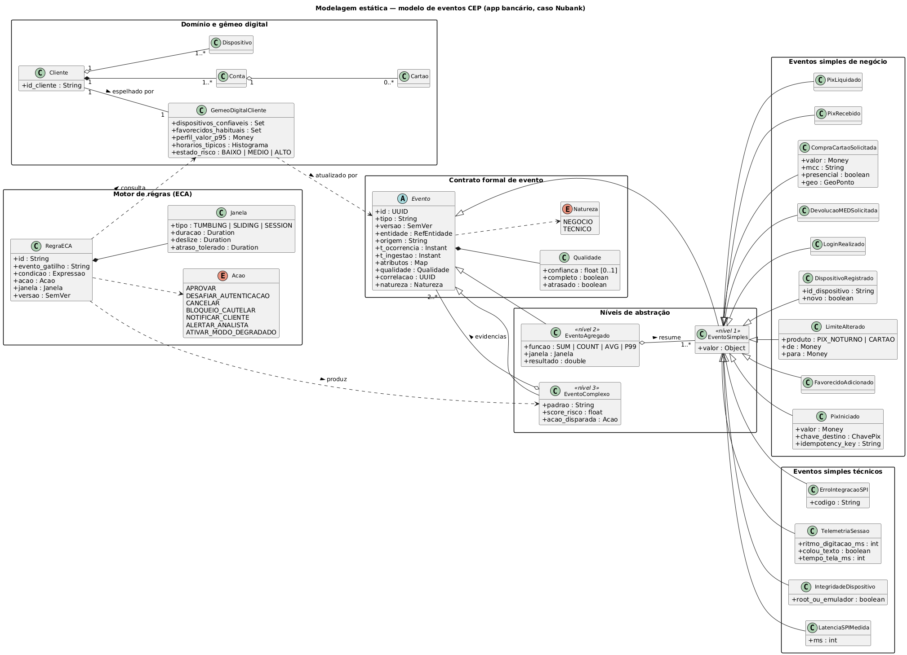
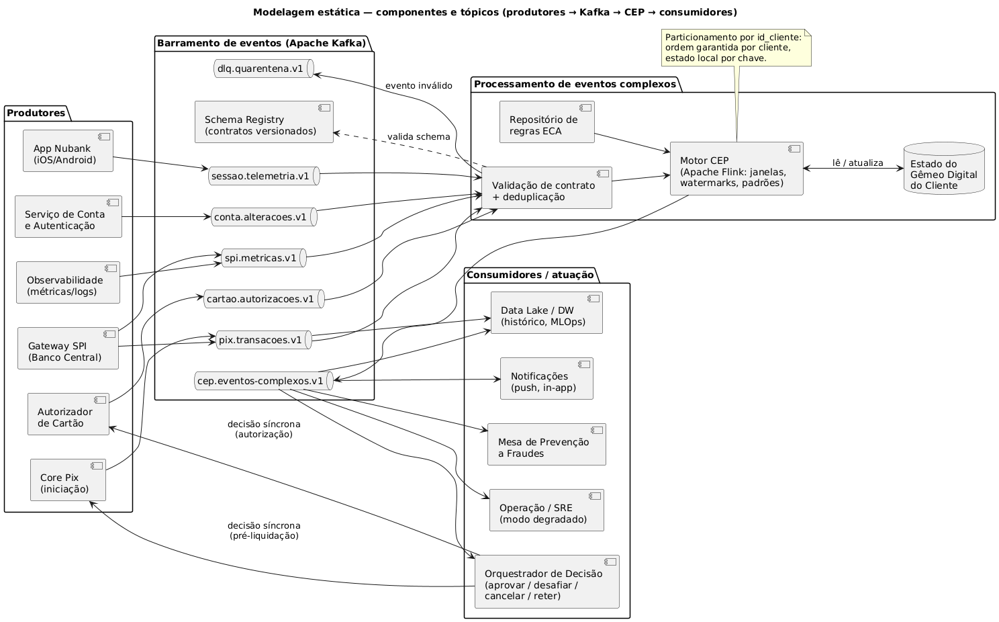
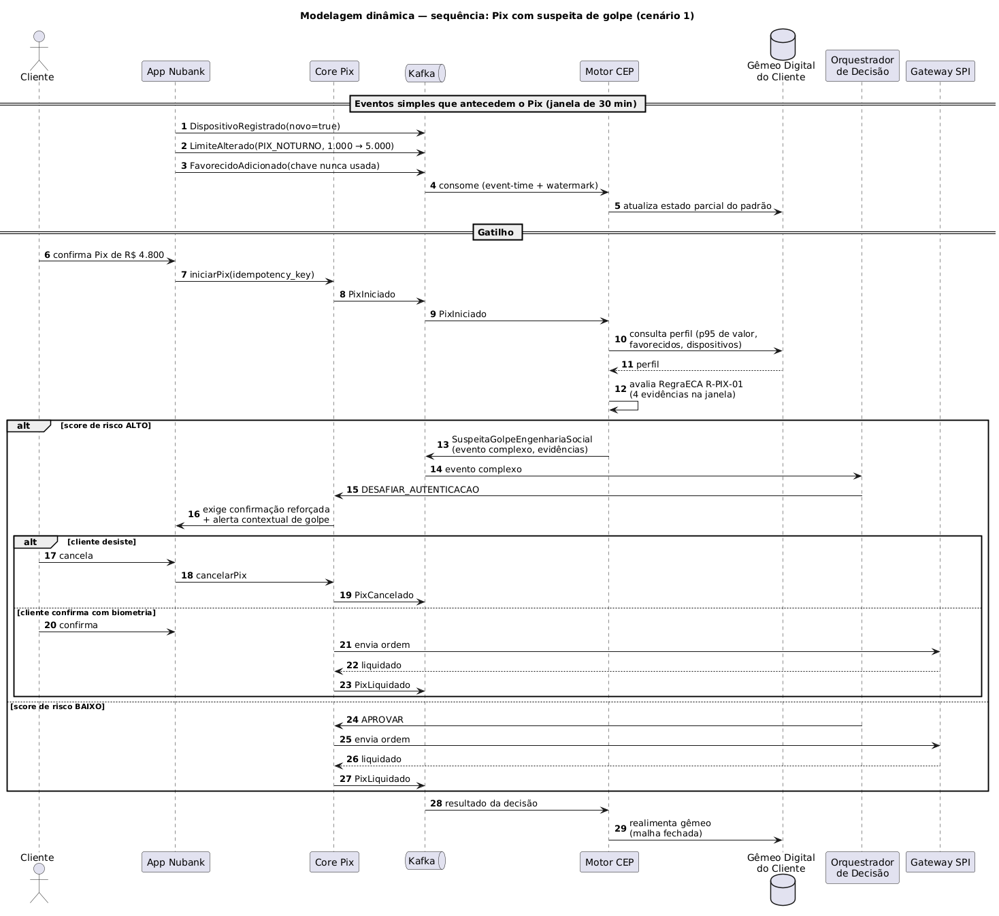
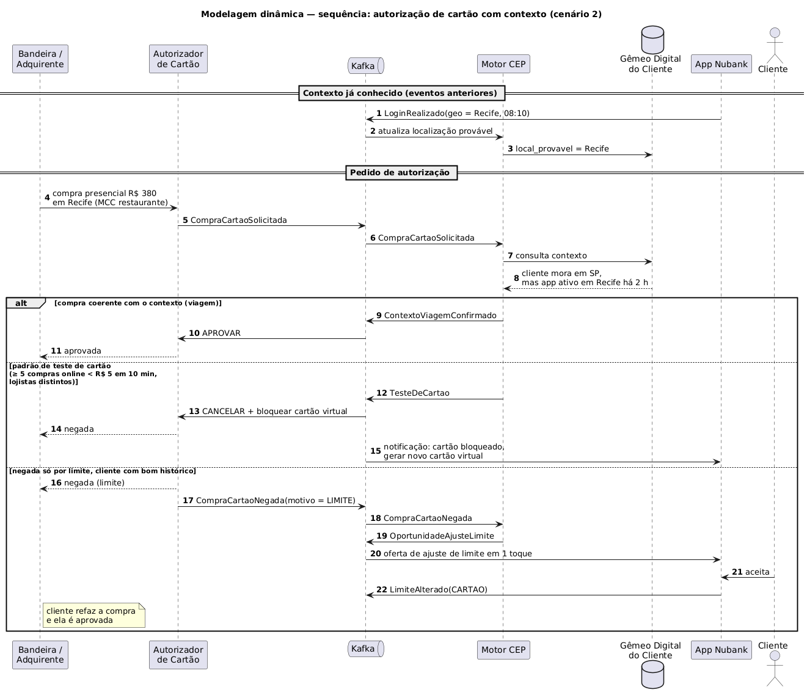
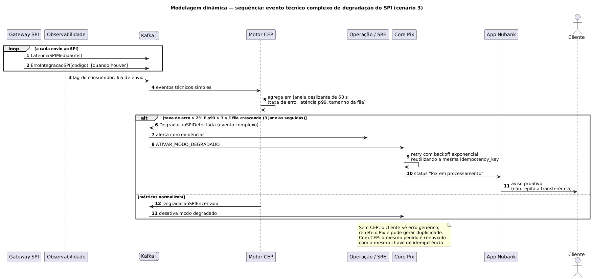
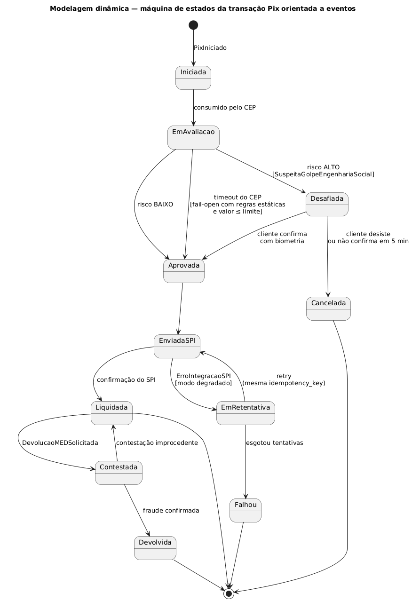
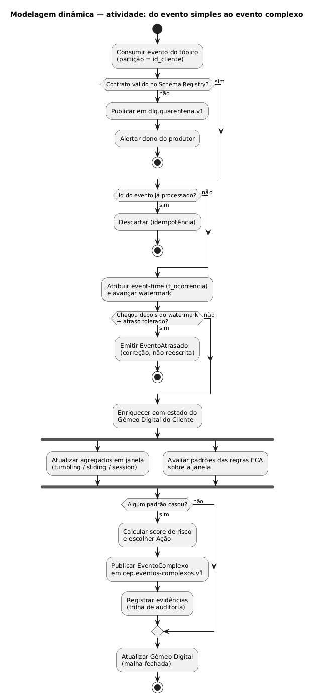

# 2. Modelagem UML (Parte 2 do enunciado)

> Elaborar uma modelagem estática e dinâmica usando UML destes eventos.

Sete diagramas: dois estáticos e cinco dinâmicos. A fonte PlantUML de cada um está em [`diagramas/src/`](../diagramas/src); para regerar os PNG:

```bash
java -jar plantuml.jar -charset UTF-8 -tpng -o ../png diagramas/src/*.puml
```

| Visão | Diagrama | Responde a |
|---|---|---|
| Estática | [2.1 Classes — modelo de eventos](#21-classes--modelo-de-eventos) | O que é um evento, quais tipos existem e como se relacionam com o domínio e com as regras? |
| Estática | [2.2 Componentes — produtores, tópicos e consumidores](#22-componentes--produtores-tópicos-e-consumidores) | Quem produz, por onde passa e quem consome cada evento? |
| Dinâmica | [2.3 Sequências (três)](#23-sequências) | Em que ordem os eventos acontecem em cada cenário de negócio? |
| Dinâmica | [2.4 Máquina de estados da transação Pix](#24-máquina-de-estados-da-transação-pix) | Como os eventos mudam o estado de uma transação? |
| Dinâmica | [2.5 Atividade — pipeline CEP](#25-atividade--pipeline-cep) | O que o motor faz com cada evento, do consumo à publicação do evento complexo? |

---

## Modelagem estática

### 2.1 Classes — modelo de eventos



**Como ler:**

- `Evento` é abstrata e carrega o **contrato formal** da aula (id, tipo, versão, entidade, origem, dois tempos, atributos, qualidade, correlação). A `natureza` separa negócio de técnico **sem** criar duas hierarquias paralelas: a mesma estrutura serve às duas.
- Os três níveis são subclasses: `EventoSimples`, `EventoAgregado` (que **resume** um ou mais simples dentro de uma `Janela`) e `EventoComplexo` (que guarda **as evidências**, dois ou mais eventos de qualquer nível). Guardar as evidências é o que permite auditar por que um Pix foi desafiado.
- As classes concretas mostram um **subconjunto representativo** do catálogo ([01](01-eventos.md)), para o diagrama continuar legível.
- `RegraECA` compõe uma `Janela` e produz `EventoComplexo`. A regra é versionada como o evento, porque mudar um limiar muda o comportamento do sistema e precisa de rastro.
- `GemeoDigitalCliente` é atualizado pelos eventos e consultado pelas regras. É ele que sabe o que é "valor alto **para este cliente**" ou "dispositivo **nunca visto**".

### 2.2 Componentes — produtores, tópicos e consumidores



**Tópicos Kafka propostos:**

| Tópico | Produtores | Eventos | Chave de partição |
|---|---|---|---|
| `sessao.telemetria.v1` | App | T01, T02, T03, T05, N01 | `id_cliente` |
| `conta.alteracoes.v1` | Serviço de conta e autenticação | N02–N05, T04 | `id_cliente` |
| `pix.transacoes.v1` | Core Pix, gateway SPI | N06–N10, N13, T11 | `id_cliente` |
| `cartao.autorizacoes.v1` | Autorizador | N11, N12, T08 | `id_cliente` |
| `spi.metricas.v1` | Gateway SPI, observabilidade | T06, T07, T09 | `instituicao` |
| `cep.eventos-complexos.v1` | Motor CEP | C01–C09 | `id_cliente` (ou `instituicao` para C08) |
| `dlq.quarentena.v1` | Validação de contrato | T10 | tópico de origem |

A chave `id_cliente` concentra todos os eventos de um cliente na mesma partição. Isso dá **ordem garantida por cliente** e deixa o estado de cada cliente num único nó do motor, sem consulta remota no caminho crítico.

---

## Modelagem dinâmica

### 2.3 Sequências

**Cenário 1 — Pix com suspeita de golpe.** Três eventos simples preparam o padrão; o `PixIniciado` é o gatilho. A decisão acontece **antes** do envio ao SPI.



**Cenário 2 — autorização de cartão com contexto.** O mesmo pedido de autorização pode terminar em três caminhos, conforme os eventos anteriores do cliente.



**Cenário 3 — degradação do SPI.** Eventos puramente técnicos formam um evento complexo que muda o comportamento do produto.



### 2.4 Máquina de estados da transação Pix



Cada transição é disparada por um evento do catálogo. Duas escolhas merecem nota:

- **`EmAvaliacao → Aprovada` por timeout** (*fail-open*). Se o motor CEP não responder a tempo, o Pix segue com regras estáticas e dentro do limite. Bloquear todos os Pix porque o antifraude caiu seria trocar um risco de fraude por uma indisponibilidade total. O trade-off está em [04](04-decisoes-arquiteturais.md#d4-duas-velocidades-de-decisão-e-fail-open-controlado).
- **`EnviadaSPI ⇄ EmRetentativa`** usa sempre a mesma chave de idempotência, para que a retentativa nunca gere um segundo pagamento.

### 2.5 Atividade — pipeline CEP



A ordem das etapas segue a arquitetura de referência da aula (*Ingestão e validação de contratos → Processamento de fluxos e CEP → Estado e modelos do gêmeo digital → Análise, previsão e decisão*, com retorno de atuação):

1. **Validar contrato antes de tudo.** Evento fora do schema vai para quarentena e não contamina as janelas.
2. **Deduplicar** pelo `id`. A entrega do Kafka é "pelo menos uma vez", então duplicatas existem.
3. **Event-time e watermark.** O evento que chega depois do limite tolerado não reabre uma decisão já tomada: vira um `EventoAtrasado` que pode gerar correção.
4. **Agregar e casar padrões em paralelo** sobre o estado enriquecido pelo gêmeo.
5. **Publicar o evento complexo com as evidências** e atualizar o gêmeo, fechando a malha.

---

## Visões RM-ODP

O Cartão de Missão pede as visões RM-ODP (ISO/IEC 10746) na etapa "Modelar". Resumo:

| Visão | Pergunta | Neste trabalho |
|---|---|---|
| **Empresa** | Para que serve, para quem, sob quais regras? | Proteger o cliente e a instituição no Pix e no cartão sem travar quem é legítimo. Regras externas: limite noturno do Pix, bloqueio cautelar só no recebedor, MED, LGPD. Cenários em [03](03-cenarios-de-negocio.md). |
| **Informação** | Que informação existe e com que semântica? | Contrato formal do evento, catálogo N/T/A/C, gêmeo digital do cliente ([2.1](#21-classes--modelo-de-eventos), [01](01-eventos.md)). |
| **Computação** | Quais objetos e interfaces fazem o trabalho? | Produtores, validação, motor CEP, repositório de regras ECA, orquestrador de decisão, notificações ([2.2](#22-componentes--produtores-tópicos-e-consumidores)). |
| **Engenharia** | Como a distribuição funciona? | Tópicos particionados por cliente, entrega pelo menos uma vez com deduplicação, estado local por chave, event-time com watermark, caminho síncrono e assíncrono ([2.5](#25-atividade--pipeline-cep), [04](04-decisoes-arquiteturais.md)). |
| **Tecnologia** | Com quais tecnologias? | Apache Kafka e Schema Registry; Apache Flink como motor CEP; armazenamento de estado do gêmeo; PlantUML para a modelagem ([04](04-decisoes-arquiteturais.md)). |
